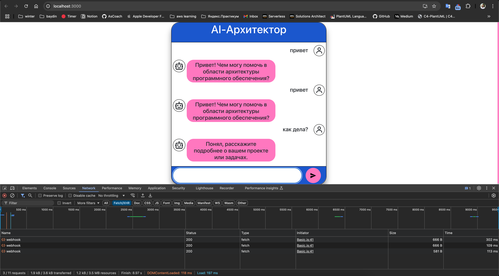

# Setting Up and Running Rasa and the Project

## Requirements
- **Python**: Supported versions are Python 3.7 - 3.10 (Python 3.11 is not supported).
- **Virtualenv**: Using a virtual environment is recommended for isolating project dependencies.

---

## 1. Set Up Python and Create a Virtual Environment
1. Ensure `pip` is installed:
   ```bash
   python -m ensurepip --upgrade
   ```
2. Install `virtualenv` if it's not already installed:
   ```bash
   pip install virtualenv
   ```
3. Create a virtual environment:
   ```bash
   python -m venv rasa_env
   ```
4. Activate the virtual environment:
   ```bash
   source rasa_env/bin/activate
   ```

---

## 2. Install Rasa
1. Install Rasa using `pip`:
   ```bash
   pip install rasa
   ```
2. Install the `Transformers` library for working with pre-trained models like BERT and GPT:
   ```bash
   pip install transformers
   ```
3. Verify that Rasa is installed:
   ```bash
   rasa --version
   ```

---

## 3. Train the Model
1. Train the model:
   ```bash
   rasa train
   ```

---

## 4. Run Rasa
1. Start the Rasa action server:
   ```bash
   rasa run actions
   ```
2. Start Rasa with CORS support:
   ```bash
   rasa run --cors "*"
   ```

---

## 5. Set Up and Run the Frontend
1. Install all necessary dependencies:
   ```bash
   npm install
   ```
2. Build the project:
   ```bash
   npm run build
   ```
3. Start the project:
   ```bash
   npm run start
   ```

---

## After this you can try to work with AI assitant in your web-browser


---
